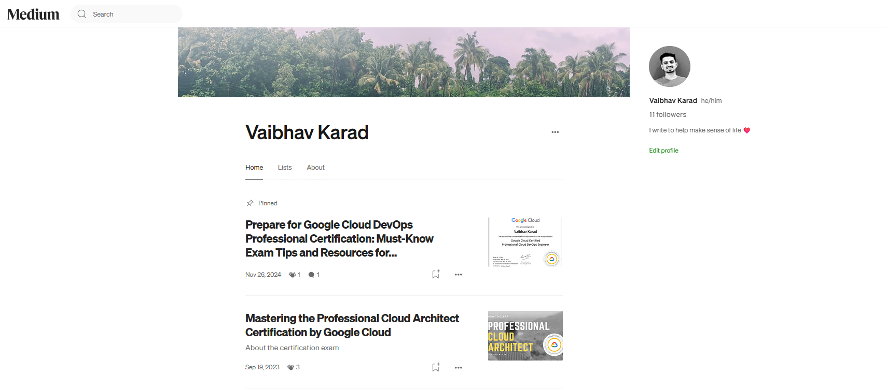

<h1 align="center">Hey there! I'm Vaibhav Karad 👨‍💻</h1>

<h4 align="center"><em>“You’re either the one that creates the automation or you’re getting automated.”</em></h4>

  

  

## 🔧 About Me

I'm a **DevOps Engineer** with 3+ years of experience in automation, CI/CD, infrastructure, and cloud platforms like **Google Cloud** and **AWS**.

- 💼 Building robust cloud-native DevOps pipelines  
- 🌱 Currently learning **Harness** and improving in **Golang**  
- 🚀 Created a ARC deployment: [**Weatherly App**](https://karadhub.github.io/weatherly/)  
- ✍️ Writing about my DevOps journey on [Medium](https://medium.com/@karadhub)  

## 🛠️ Tech Stack

| Category                    | Tools & Technologies |
|-----------------------------|----------------------|
| **Cloud**                   |   |
| **Containers & Orchestration** |   |
| **Infrastructure as Code** |   |
| **CI/CD**                   |   |
| **Artifact Repositories**  |  |
| **Monitoring & Logging**   |   |
| **Messaging & Streaming**  |   |
| **Languages**              |    |
| **Databases**              |   |
| **Web & Servers**          |   |
| **Operating Systems**      |  |

## 📊 GitHub Stats

  
  
  

## 📘 Blog Posts

  

### 📰 Recent Blog Posts

🚀  [**Prepare for Google Cloud DevOps Professional Certification**](https://medium.com/@karadhub/prepare-for-google-cloud-devops-professional-certification-must-know-exam-tips-and-resources-for-5c9a394f21c4) *Must-know exam tips and preparation flow* 

🧠 [**Mastering the Professional Cloud Architect Certification**](https://medium.com/@karadhub/mastering-the-professional-cloud-architect-certification-by-google-cloud-41c3d9c74f1) *Step-by-step overview and key topics covered* 

  👉 <a href="https://medium.com/@karadhub" target="_blank"><strong>Explore more on Medium</strong></a>

## 📄 License
This project is licensed under the [MIT License](LICENSE).  
Feel free to fork or reuse with attribution.

  You've reached the end, but the journey’s just beginning.  
   
  Made with ❤️ by <strong>Vaibhav Karad</strong>

<h2 align="center">Let's Connect</h2>

  
  
  
  

